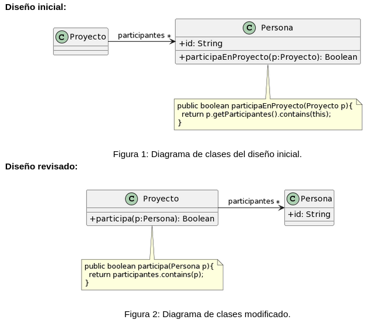

## 1.2 Participación en proyectos 

Al revisar el siguiente diseño inicial (Figura 1), se decidió realizar un cambio para evitar lo que se consideraba un mal olor. El diseño modificado se muestra en la Figura 2. Indique qué tipo de cambio se realizó y si lo considera apropiado. Justifique su respuesta.

El resideño consistió en cambiar la asignación de responsabilidades. En el diseño inicial, es una persona (instancia de Persona) quien verifica si participa en un determinado proyecto (instancia de Proyecto).
Si, considero apropiado el cambio, pues se observa que en la implementación inicial se recibía en Persona un objeto Proyecto y se le pedía sus participantes para verificar si dicha persona pertenecía a él. Esto muestra claramente un **Feature Envy**, por lo que trasladar la responsabilidad a quién posee los datos (Proyecto) es lo indicado.
A su vez, se detecta que la privacidad pública de la variable de instancia "id" de Persona rompe el encapsulamiento del mismo, por lo que debería aplicarse **Encapsulate Field**