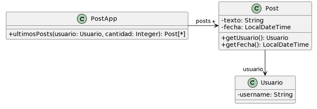

# 2.3 Publicaciones



```java
01. /**
02.  * Retorna los últimos N posts que no pertenecen al usuario user
03.  */
04. public List<Post> ultimosPosts(Usuario user, int cantidad) {
05.     
06.     List<Post> postsOtrosUsuarios = new ArrayList<Post>();
07.     for (Post post : this.posts) {
08.         if (!post.getUsuario().equals(user)) {
09.             postsOtrosUsuarios.add(post);
10.         }
11.     }
12.     
13.     // ordena los posts por fecha
14.     for (int i = 0; i < postsOtrosUsuarios.size(); i++) {
15.         int masNuevo = i;
16.         for (int j = i + 1; j < postsOtrosUsuarios.size(); j++) {
17.             if (postsOtrosUsuarios.get(j).getFecha().isAfter(
18.                 postsOtrosUsuarios.get(masNuevo).getFecha())) {
19.                 masNuevo = j;
20.             }
21.         }
22.         Post unPost = postsOtrosUsuarios.set(i, postsOtrosUsuarios.get(masNuevo));
23.         postsOtrosUsuarios.set(masNuevo, unPost);
24.     }
25.     
26.     List<Post> ultimosPosts = new ArrayList<Post>();
27.     int index = 0;
28.     Iterator<Post> postIterator = postsOtrosUsuarios.iterator();
29.     while (postIterator.hasNext() && index < cantidad) {
30.         ultimosPosts.add(postIterator.next());
31.         index++;
32.     }
33.     return ultimosPosts;
34. }
```

### Bad Smell: Long Method

### Refactoring: Extract Method
Funcionalidad de obtener posts de otros usuarios es extraída a otro método

```java
01. public List<Post> devolverPostsNoPertenecientesAlUsuario(Usuario user) {
02.     List<Post> postsOtrosUsuarios = new ArrayList<Post>();
03.     for (Post post : this.posts) {
04.         if (!post.getUsuario().equals(user)) {
05.             postsOtrosUsuarios.add(post);
06.         }
07.     }
08.     return postsOtrosUsuarios;
09. }
10. 
11. /**
12.  * Retorna los últimos N posts que no pertenecen al usuario user
13.  */
14. public List<Post> ultimosPosts(Usuario user, int cantidad) {
15.     
16.     List<Post> postsOtrosUsuarios = this.devolverPostsNoPertenecientesAlUsuario(user);
17.     
18.     // ordena los posts por fecha
19.     for (int i = 0; i < postsOtrosUsuarios.size(); i++) {
20.         int masNuevo = i;
21.         for (int j = i + 1; j < postsOtrosUsuarios.size(); j++) {
22.             if (postsOtrosUsuarios.get(j).getFecha().isAfter(
23.                 postsOtrosUsuarios.get(masNuevo).getFecha())) {
24.                 masNuevo = j;
25.             }
26.         }
27.         Post unPost = postsOtrosUsuarios.set(i, postsOtrosUsuarios.get(masNuevo));
28.         postsOtrosUsuarios.set(masNuevo, unPost);
29.     }
30.     
31.     List<Post> ultimosPosts = new ArrayList<Post>();
32.     int index = 0;
33.     Iterator<Post> postIterator = postsOtrosUsuarios.iterator();
34.     while (postIterator.hasNext() && index < cantidad) {
35.         ultimosPosts.add(postIterator.next());
36.         index++;
37.     }
38.     return ultimosPosts;
39. }
```

### Bad Smell: Long Method

### Refactoring: Extract Method
Se extrae funcionalidad de ordenar Posts por fecha.

```java
01. public List<Post> devolverPostsNoPertenecientesAlUsuario(Usuario user) {
02.     List<Post> postsOtrosUsuarios = new ArrayList<Post>();
03.     for (Post post : this.posts) {
04.         if (!post.getUsuario().equals(user)) {
05.             postsOtrosUsuarios.add(post);
06.         }
07.     }
08.     return postsOtrosUsuarios;
09. }
10. 
11. public void ordenarPostsPorFecha(List<Post> posts) {
12.     // ordena los posts por fecha
13.     for (int i = 0; i < posts.size(); i++) {
14.         int masNuevo = i;
15.         for (int j = i + 1; j < posts.size(); j++) {
16.             if (posts.get(j).getFecha().isAfter(
17.                 posts.get(masNuevo).getFecha())) {
18.                 masNuevo = j;
19.             }
20.         }
21.         Post unPost = posts.set(i, posts.get(masNuevo));
22.         posts.set(masNuevo, unPost);
23.     }
24. }
25. 
26. /**
27.  * Retorna los últimos N posts que no pertenecen al usuario user
28.  */
29. public List<Post> ultimosPosts(Usuario user, int cantidad) {
30.     
31.     List<Post> postsOtrosUsuarios = this.devolverPostsNoPertenecientesAlUsuario(user);
32.     
33.     this.ordenarPostsPorFecha(postsOtrosUsuarios);
34.     
35.     List<Post> ultimosPosts = new ArrayList<Post>();
36.     int index = 0;
37.     Iterator<Post> postIterator = postsOtrosUsuarios.iterator();
38.     while (postIterator.hasNext() && index < cantidad) {
39.         ultimosPosts.add(postIterator.next());
40.         index++;
41.     }
42.     return ultimosPosts;
43. }
```

### Bad Smell: Long Method

### Refactoring: Extract Method
Se extrae funcionalidad de filtrar n posts de `ultimosPosts`

```java
01. public List<Post> devolverPostsNoPertenecientesAlUsuario(Usuario user) {
02.     List<Post> postsOtrosUsuarios = new ArrayList<Post>();
03.     for (Post post : this.posts) {
04.         if (!post.getUsuario().equals(user)) {
05.             postsOtrosUsuarios.add(post);
06.         }
07.     }
08.     return postsOtrosUsuarios;
09. }
10. 
11. public void ordenarPostsPorFecha(List<Post> posts) {
12.     // ordena los posts por fecha
13.     for (int i = 0; i < posts.size(); i++) {
14.         int masNuevo = i;
15.         for (int j = i + 1; j < posts.size(); j++) {
16.             if (posts.get(j).getFecha().isAfter(
17.                 posts.get(masNuevo).getFecha())) {
18.                 masNuevo = j;
19.             }
20.         }
21.         Post unPost = posts.set(i, posts.get(masNuevo));
22.         posts.set(masNuevo, unPost);
23.     }
24. }
25. 
26. public List<Post> obtenerPrimerosNPosts(List<Post> posts, int cantidad) {
27.     List<Post> ultimosPosts = new ArrayList<Post>();
28.     int index = 0;
29.     Iterator<Post> postIterator = posts.iterator();
30.     while (postIterator.hasNext() && index < cantidad) {
31.         ultimosPosts.add(postIterator.next());
32.         index++;
33.     }
34.     return ultimosPosts;
35. }
36. 
37. /**
38.  * Retorna los últimos N posts que no pertenecen al usuario user
39.  */
40. public List<Post> ultimosPosts(Usuario user, int cantidad) {
41.     List<Post> postsOtrosUsuarios = this.devolverPostsNoPertenecientesAlUsuario(user);
42.     this.ordenarPostsPorFecha(postsOtrosUsuarios);
43.     List<Post> ultimosPosts = this.obtenerPrimerosNPosts(postsOtrosUsuarios, cantidad);
44.     return ultimosPosts;
45. }
```

### Bad Smell: Feature Envy
Línea 4: se pide dato perteneciente a Post para realizar tarea. Mala asignación de responsabilidad

### Refactoring: Extract Method y Move Method
Se extrae dicha funcionalidad y se mueve a la clase que efectivamente es responsable de esa tarea

```java
01. public class Usuario {
02.     //... variables de instancia, constructores y getters de Usuario
03. 
04.     @Override
05.     public boolean equals(Object obj) {
06.         if (this == obj) return true;
07.         if (obj == null || getClass() != obj.getClass()) return false;
08.         Usuario otro = (Usuario) obj;
09.         return this.username.equals(otro.username);
10.     }
11. }
12. 
13. public class Post {
14.     //... variables de instancia, constructores y getters de Post
15. 
16.     public boolean esMismoUsuario(Usuario user) {
17.         return this.usuario.equals(user);
18.     }
19. }
20. 
21. public class PostApp {
22. 
23.     public List<Post> devolverPostsNoPertenecientesAlUsuario(Usuario user) {
24.         List<Post> postsOtrosUsuarios = new ArrayList<Post>();
25.         for (Post post : this.posts) {
26.             if (!post.esMismoUsuario(user)) {
27.                 postsOtrosUsuarios.add(post);
28.             }
29.         }
30.         return postsOtrosUsuarios;
31.     }
32. 
33.     public void ordenarPostsPorFecha(List<Post> posts) {
34.         // ordena los posts por fecha
35.         for (int i = 0; i < posts.size(); i++) {
36.             int masNuevo = i;
37.             for (int j = i + 1; j < posts.size(); j++) {
38.                 if (posts.get(j).getFecha().isAfter(
39.                     posts.get(masNuevo).getFecha())) {
40.                     masNuevo = j;
41.                 }
42.             }
43.             Post unPost = posts.set(i, posts.get(masNuevo));
44.             posts.set(masNuevo, unPost);
45.         }
46.     }
47. 
48.     public List<Post> obtenerPrimerosNPosts(List<Post> posts, int cantidad) {
49.         List<Post> ultimosPosts = new ArrayList<Post>();
50.         int index = 0;
51.         Iterator<Post> postIterator = posts.iterator();
52.         while (postIterator.hasNext() && index < cantidad) {
53.             ultimosPosts.add(postIterator.next());
54.             index++;
55.         }
56.         return ultimosPosts;
57.     }
58. 
59.     /**
60.      * Retorna los últimos N posts que no pertenecen al usuario user
61.      */
62.     public List<Post> ultimosPosts(Usuario user, int cantidad) {
63.         List<Post> postsOtrosUsuarios = this.devolverPostsNoPertenecientesAlUsuario(user);
64.         this.ordenarPostsPorFecha(postsOtrosUsuarios);
65.         List<Post> ultimosPosts = this.obtenerPrimerosNPosts(postsOtrosUsuarios, cantidad);
66.         return ultimosPosts;
67.     }
68. }
```

### Bad Smell: Reiventa la rueda
En métodos `devolverPostsNoPertenecientesAlUsuario()`, `ordenarPostsPorFecha()` y `obtenerPrimerosNPosts()`

### Refactoring: Replace Loop with Pipeline

```java
01. public class Usuario {
02.     //... variables de instancia, constructores y getters de Usuario
03. 
04.     @Override
05.     public boolean equals(Object obj) {
06.         if (this == obj) return true;
07.         if (obj == null || getClass() != obj.getClass()) return false;
08.         Usuario otro = (Usuario) obj;
09.         return this.username.equals(otro.username);
10.     }
11. }
12. 
13. public class Post {
14.     //... variables de instancia, constructores y getters de Post
15. 
16.     public boolean esMismoUsuario(Usuario user) {
17.         return this.usuario.equals(user);
18.     }
19. }
20. 
21. public class PostApp {
22. 
23.     public List<Post> devolverPostsNoPertenecientesAlUsuario(Usuario user) {
24.         return this.posts.stream()
25.             .filter(p -> !p.esMismoUsuario(user))
26.             .collect(Collectors.toList());
27.     }
28. 
29.     public List<Post> ordenarPostsPorFecha(List<Post> posts) {
30.         return posts.stream()
31.             .sorted((p1, p2) -> p1.getFecha().compareTo(p2.getFecha())) // Pasar CompareTo a Post?
32.             .collect(Collectors.toList());
33.     }
34. 
35.     public List<Post> obtenerPrimerosNPosts(List<Post> posts, int cantidad) {
36.         return posts.stream().limit(cantidad).collect(Collectors.toList());
37.     }
38. 
39.     /**
40.      * Retorna los últimos N posts que no pertenecen al usuario user
41.      */
42.     public List<Post> ultimosPosts(Usuario user, int cantidad) {
43.         List<Post> postsOtrosUsuarios = this.devolverPostsNoPertenecientesAlUsuario(user);
44.         List<Post> ordenados = this.ordenarPostsPorFecha(postsOtrosUsuarios);
45.         List<Post> ultimosPosts = this.obtenerPrimerosNPosts(ordenados, cantidad);
46.         return ultimosPosts;
47.     }
48. }
```

### Bad Smell: Long Method
`ultimosPosts()` es un método largo

### Refactoring: Replace Temp with Query

```java
01. public class Usuario {
02.     //... variables de instancia, constructores y getters de Usuario
03. 
04.     @Override
05.     public boolean equals(Object obj) {
06.         if (this == obj) return true;
07.         if (obj == null || getClass() != obj.getClass()) return false;
08.         Usuario otro = (Usuario) obj;
09.         return this.username.equals(otro.username);
10.     }
11. }
12. 
13. public class Post {
14.     //... variables de instancia, constructores y getters de Post
15. 
16.     public boolean esMismoUsuario(Usuario user) {
17.         return this.usuario.equals(user);
18.     }
19. }
20. 
21. public class PostApp {
22. 
23.     public List<Post> devolverPostsNoPertenecientesAlUsuario(Usuario user) {
24.         return this.posts.stream()
25.             .filter(p -> !p.esMismoUsuario(user))
26.             .collect(Collectors.toList());
27.     }
28. 
29.     public List<Post> ordenarPostsPorFecha(List<Post> posts) {
30.         return posts.stream()
31.             .sorted((p1, p2) -> p1.getFecha().compareTo(p2.getFecha())) // Pasar CompareTo a Post?
32.             .collect(Collectors.toList());
33.     }
34. 
35.     public List<Post> obtenerPrimerosNPosts(List<Post> posts, int cantidad) {
36.         return posts.stream()
37.             .limit(cantidad)
38.             .collect(Collectors.toList());
39.     }
40. 
41.     /**
42.      * Retorna los últimos N posts que no pertenecen al usuario user
43.      */
44.     public List<Post> ultimosPosts(Usuario user, int cantidad) {
45.         return this.obtenerPrimerosNPosts(
46.             this.ordenarPostsPorFecha(
47.                 this.devolverPostsNoPertenecientesAlUsuario(user)
48.             ),
49.             cantidad
50.         );
51.     }
52. }
```

### Bad Smell: Nombre poco explicativo
`ultimosPosts()` tiene nombre poco explicativo

### Refactoring: Rename Method

```java
01. public class Usuario {
02.     //... variables de instancia, constructores y getters de Usuario
03. 
04.     @Override
05.     public boolean equals(Object obj) {
06.         if (this == obj) return true;
07.         if (obj == null || getClass() != obj.getClass()) return false;
08.         Usuario otro = (Usuario) obj;
09.         return this.username.equals(otro.username);
10.     }
11. }
12. 
13. public class Post {
14.     //... variables de instancia, constructores y getters de Post
15. 
16.     public boolean esMismoUsuario(Usuario user) {
17.         return this.usuario.equals(user);
18.     }
19. }
20. 
21. public class PostApp {
22. 
23.     public List<Post> devolverPostsNoPertenecientesAlUsuario(Usuario user) {
24.         return this.posts.stream()
25.             .filter(p -> !p.esMismoUsuario(user))
26.             .collect(Collectors.toList());
27.     }
28. 
29.     public List<Post> ordenarPostsPorFecha(List<Post> posts) {
30.         return posts.stream()
31.             .sorted((p1, p2) -> p1.getFecha().compareTo(p2.getFecha())) // Pasar CompareTo a Post?
32.             .collect(Collectors.toList());
33.     }
34. 
35.     public List<Post> obtenerPrimerosNPosts(List<Post> posts, int cantidad) {
36.         return posts.stream()
37.             .limit(cantidad)
38.             .collect(Collectors.toList());
39.     }
40. 
41.     /**
42.      * Retorna los últimos N posts que no pertenecen al usuario user
43.      */
44.     public List<Post> ObtenerUltimosNPostsDeUsuario(Usuario user, int cantidad) {
45.         return this.obtenerPrimerosNPosts(
46.             this.ordenarPostsPorFecha(
47.                 this.devolverPostsNoPertenecientesAlUsuario(user)
48.             ),
49.             cantidad
50.         );
51.     }
52. }
```

### Bad Smell: Feature Envy
En línea 31 se pide información de `Post` para realizar operación

### Refactoring: Extract Method y Move Method

```java
01. public class Usuario {
02.     //... variables de instancia, constructores y getters de Usuario
03. 
04.     @Override
05.     public boolean equals(Object obj) {
06.         if (this == obj) return true;
07.         if (obj == null || getClass() != obj.getClass()) return false;
08.         Usuario otro = (Usuario) obj;
09.         return this.username.equals(otro.username);
10.     }
11. }
12. 
13. public class Post implements Comparable<Post> {
14.     //... variables de instancia, constructores y getters de Post
15. 
16.     public boolean esMismoUsuario(Usuario user) {
17.         return this.usuario.equals(user);
18.     }
19. 
20.     @Override
21.     public int compareTo(Post otroPost) {
22.         return otroPost.getFecha().compareTo(this.getFecha()); // Más nuevo primero
23.     }
24. }
25. 
26. public class PostApp {
27. 
28.     public List<Post> devolverPostsNoPertenecientesAlUsuario(Usuario user) {
29.         return this.posts.stream()
30.             .filter(p -> !p.esMismoUsuario(user))
31.             .collect(Collectors.toList());
32.     }
33. 
34.     public List<Post> ordenarPostsPorFecha(List<Post> posts) {
35.         return posts.stream()
36.             .sorted()
37.             .collect(Collectors.toList());
38.     }
39. 
40.     public List<Post> obtenerPrimerosNPosts(List<Post> posts, int cantidad) {
41.         return posts.stream()
42.             .limit(cantidad)
43.             .collect(Collectors.toList());
44.     }
45. 
46.     /**
47.      * Retorna los últimos N posts que no pertenecen al usuario user
48.      */
49.     public List<Post> ultimosPosts(Usuario user, int cantidad) {
50.         return this.obtenerPrimerosNPosts(
51.             this.ordenarPostsPorFecha(
52.                 this.devolverPostsNoPertenecientesAlUsuario(user)
53.             ),
54.             cantidad
55.         );
56.     }
57. }
```